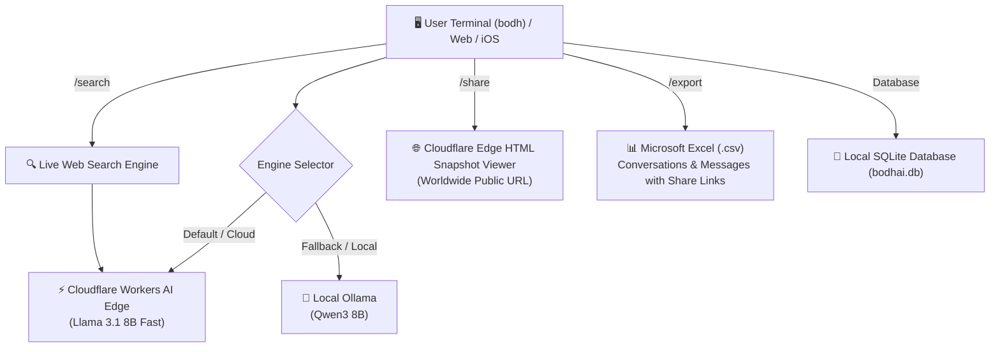

# 🌟 Bodh AI

<div align="center">

```
 ██████╗  ██████╗ ██████╗ ██╗  ██╗     █████╗ ██╗
 ██╔══██╗██╔═══██╗██╔══██╗██║  ██║    ██╔══██╗██║
 ██████╔╝██║   ██║██║  ██║███████║    ███████║██║
 ██╔══██╗██║   ██║██║  ██║██╔══██║    ██╔══██║██║
 ██████╔╝╚██████╔╝██████╔╝██║  ██║    ██║  ██║██║
 ╚═════╝  ╚═════╝ ╚═════╝ ╚═╝  ╚═╝    ╚═╝  ╚═╝╚═╝
```

**The Intelligent, High-Speed Dual-Engine AI Terminal Assistant & Cloud Platform**

[](https://workers.cloudflare.com/)
[](https://www.python.org/)
[](https://ollama.ai/)
[](LICENSE)

*Made with ❤️ by [Aarush](https://github.com/aarush0008x) • In Collab With [Renuka](https://github.com/Renuka-wq)*

[Features](#-key-features) • [Installation](#-1-line-quick-installation) • [Uninstallation](#-1-line-uninstallation-all-devices) • [Android Guide](#-how-to-use-on-android) • [iOS / iPhone Guide](#-how-to-use-on-ios--iphone) • [CLI Commands](#-cli-commands) • [Architecture](#-architecture)

</div>

---

## ✨ Key Features

- ⚡ **Dual AI Engine**: Seamlessly switches between ultra-fast **Cloudflare Workers AI** (`Llama 3.1 8B`) and private offline **Local Ollama** (`Qwen3-8B`) with instant auto-fallback.
- 🔍 **Live Real-Time Web Search (`/search`)**: Queries the live internet in real time and synthesizes comprehensive answers with cited source links.
- 🌐 **Worldwide Free Public Share Links (`/share`)**: Generates standalone, dark-mode web snapshot links hosted on Cloudflare edge with 1-click code copying.
- 📊 **1-Click Excel Database Export (`/export`)**: Exports all conversations and message history into UTF-8 spreadsheets containing clickable web share links.
- 🖼️ **Cloud Vision & Image Generation (`/image`, `/vision`)**: Generates AI images from text prompts and inspects/analyzes uploaded pictures.
- 💾 **Local Relational Persistence**: Complete session history management with `/history`, `/resume <#>`, `/rename <title>`, and `/delete`.
- 📦 **Standalone Windows Executable (`bodh.exe`)**: 47 MB single-file executable requiring zero Python installation.

---

## 🚀 1-Line Quick Installation

Install and run Bodh AI on any operating system with a single command:

### 🪟 Windows (PowerShell)
```powershell
iwr -useb https://api.bodhai.aarushdevworld.workers.dev/install.ps1 | iex
```

### 🍎 macOS (Terminal)
```bash
curl -fsSL https://api.bodhai.aarushdevworld.workers.dev/install.sh | bash
```

### 🤖 Android (Termux)
> **Prerequisite**: Install **[Termux from F-Droid](https://f-droid.org/en/packages/com.termux/)** *(Recommended)* or **[GitHub Releases](https://github.com/termux/termux-app/releases/latest)**. *(Do not use Google Play Store version as it is deprecated).*
```bash
pkg update -y && pkg install curl python -y && curl -fsSL https://api.bodhai.aarushdevworld.workers.dev/install.sh | bash
```

### 🐧 Linux (Ubuntu / Debian / Arch / Fedora)
```bash
curl -fsSL https://api.bodhai.aarushdevworld.workers.dev/install.sh | bash
```

---

## 🗑️ 1-Line Uninstallation (All Devices)

To completely remove Bodh AI and its local files from any system:

### 🪟 Windows (PowerShell)
```powershell
iwr -useb https://api.bodhai.aarushdevworld.workers.dev/uninstall.ps1 | iex
```
*(Removes `bodh.bat`, `bodhai.py`, database, and executables).*

### 🍎 macOS / 🐧 Linux (Terminal)
```bash
curl -fsSL https://api.bodhai.aarushdevworld.workers.dev/uninstall.sh | bash
```

### 🤖 Android (Termux)
```bash
rm -f $PREFIX/bin/bodh bodh.py && rm -rf ~/.bodhai
```

### 📱 iOS / iPhone
- **PWA**: Long-press the **Bodh AI** icon on your home screen > **Delete Bookmark / App**.
- **Shortcuts**: Open the **Shortcuts** app > Delete the **"Ask Bodh AI"** shortcut.
- **iSH / a-Shell**: Run `rm -f bodh.py && rm -rf ~/.bodhai`.

---

## 🤖 How to Use on Android

You can run Bodh AI on Android either natively inside the terminal or as a standalone app:

### Method 1: Android Native Terminal (Termux)
1. Download & install **Termux** from **[F-Droid](https://f-droid.org/en/packages/com.termux/)** *(Recommended)* or **[GitHub Releases](https://github.com/termux/termux-app/releases/latest)** *(APK direct download)*.
   > *Note: Please avoid the Google Play Store build of Termux as it is outdated and unsupported.*
2. Launch Termux and run the 1-command installer:
   ```bash
   pkg update -y && pkg install curl python -y
   curl -fsSL https://api.bodhai.aarushdevworld.workers.dev/install.sh | bash
   ```
3. Type `bodh` anytime to launch!

---

### Method 2: Android Progressive Web App (PWA)
1. Open **Chrome**, **Brave**, or **Edge** on your Android device.
2. Visit:
   ```text
   https://api.bodhai.aarushdevworld.workers.dev
   ```
3. Tap the **Three Dots (⋮)** menu in the top right > Tap **"Install app"** or **"Add to Home screen"**.
4. Bodh AI will appear on your app drawer and home screen as a standalone application.

---

## 📱 How to Use on iOS / iPhone

You can use Bodh AI on your iPhone or iPad using **three convenient methods**:

### Method 1: Progressive Web App (PWA) / Safari (Recommended)
1. Open **Safari** on your iPhone.
2. Navigate to:
   ```text
   https://api.bodhai.aarushdevworld.workers.dev
   ```
3. Tap the **Share Button** (box with arrow pointing up at the bottom).
4. Scroll down and tap **"Add to Home Screen"**.
5. You now have a full-screen **Bodh AI App icon** on your iPhone home screen!

---

### Method 2: Apple Shortcuts (Siri / Action Button / Home Screen Widget)
1. Open the **Shortcuts** app on iOS.
2. Create a new shortcut named **"Ask Bodh AI"**.
3. Add action: **"Ask for Input"** (Prompt: *"What do you want to ask Bodh AI?"*).
4. Add action: **"Get Contents of URL"**:
   * URL: `https://api.bodhai.aarushdevworld.workers.dev/api/chat?q=` + `[Provided Input]`
   * Method: `GET`
5. Add action: **"Get Dictionary Value"** -> Key: `response`.
6. Add action: **"Show Result"** or **"Speak Text"**.
7. *Tip*: Assign this shortcut to your **Action Button** (iPhone 15 Pro / 16) or add a 1-tap widget!

---

### Method 3: iOS Terminal (iSH Shell / a-Shell)
1. Install **[a-Shell](https://apps.apple.com/app/a-shell/id1473805438)** or **[iSH](https://apps.apple.com/app/ish-shell/id1436902243)** from the App Store (Free).
2. Open the terminal app and run:
   ```bash
   pip install rich httpx
   curl -fsSL https://api.bodhai.aarushdevworld.workers.dev/bodh.py -o bodh.py
   python3 bodh.py
   ```

---

## 💻 CLI Commands

Once installed, simply run `bodh` in your terminal:

```cmd
bodh
```

| Command | Description |
| :--- | :--- |
| **`/search <query>`** | Search live web in real time and synthesize answer with source citations |
| **`/export`** | Export database to Excel (`.csv`) with clickable public share links |
| **`/share`** | Generate worldwide free public web share link for current chat |
| **`/provider [local\|cloud]`** | View or switch between Local Ollama & Cloudflare Workers AI |
| **`/image <prompt>`** | Generate AI image via Cloud Vision Engine |
| **`/vision <path> [prompt]`**| Analyze local or remote image with Vision AI |
| **`/history`** | List past conversations (Today, Yesterday, Older) |
| **`/resume <#\|id>`** | Switch to a past conversation by number or ID |
| **`/rename <title>`** | Rename the current conversation |
| **`/delete`** | Delete the current conversation |
| **`/new`** | Start a new conversation session |
| **`/continue`** | Continue generating incomplete or stopped response |
| **`/regenerate`** | Regenerate the last assistant response |
| **`/status`** | Show engine & database connection status |
| **`/clear`** | Clear terminal screen |
| **`/exit, quit`** | Exit Bodh AI |

---

## 🏗️ Architecture



---

## 🛠️ Developer Setup & Local Development

### 1. Clone the repository
```bash
git clone https://github.com/aarush0008x/BodhAI.git
cd BodhAI
```

### 2. Backend Setup
```bash
cd backend
python -m venv venv
venv\Scripts\activate   # On Windows
source venv/bin/activate # On Mac/Linux

pip install -r requirements.txt
python -m pytest tests/test_backend.py -v
```

### 3. Run Backend API Server
```bash
uvicorn app.main:app --reload --port 8000
```

### 4. Deploy Cloudflare Worker
```bash
npx wrangler deploy --config wrangler.toml
```

---

## 📄 License

Distributed under the MIT License. See `LICENSE` for more information.

---

<div align="center">
  <b>Made with ❤️ by <a href="https://github.com/aarush0008x">Aarush</a> • In Collab With <a href="https://github.com/Renuka-wq">Renuka</a></b>
</div>
